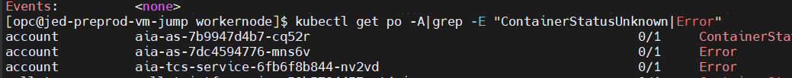
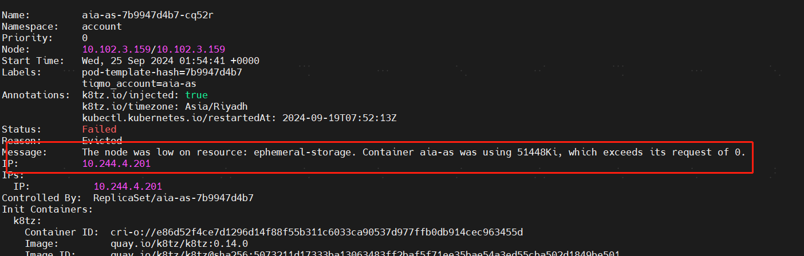

# Error排错：The node was low on resource: ephemeral-storage

# 1.问题现象
k8s 存在 error状态 的pod

**核心原因是磁盘被占用，存储空间不足。**

# **2.排查过程**
2.1 ephemeral-storage(短暂存储)的概念和作用

ephemeral-storage是为了管理和调度Kubernetes中运行的应用的短暂存储。

在每个Kubernetes的节点上，kubelet的根目录(默认是/var/lib/kubelet)和日志目录(/var/log)保存在节点的主分区上，这个分区同时也会被Pod的EmptyDir类型的volume、容器日志、镜像的层、容器的可写层所占用。ephemeral-storage便是对这块主分区进行管理，通过应用定义的需求(requests)和约束(limits)来调度和管理节点上的应用对主分区的消耗。

我们使用df -h可以看到/var/lib下有很多容器相关的目录，这些都是ephemeral-storage

2.2 image镜像重新下载

pod在启动时要重新下载相关镜像，说明由于磁盘容量不够时，kubernetes会清理镜像文件去腾空磁盘，省出资源去优先启动pod。

符合上述1中所述的“镜像层占用ephemeral-storage”。

2.3 本地pv存储占用磁盘

如2所述，kubernetes中的allinone的各个组件的持久化存储都是用的本地盘(系统盘)。

2.4 有些容器化组件没有使用持久存储

造成应用的日志全部打印到了容器里，也就是/var/log目录下，耗用了ephemeral-storage。

# 3.原因总结
根本原因：Kubernetes使用的系统盘容量不足；触发项如下：

1.image镜像太多，耗用太多ephemeral-storage；

2.本地pv存储全部挂载了系统盘目录下；

3.有些容器没有使用持久化存储，日志等全部打印到了ephemeral-storage。

# 4.解决方式
原则：让ephemeral-storage只存储kubernetes体系下的日志，系统盘容量要充足。

1.image镜像层的存储指定非系统盘；

2.本地pv存储挂载非系统盘；(生产环境禁止使用本地磁盘，必须使用独立盘或者云存储)

3.容器必须都使用持久化存储，禁止把日志都打到容器里。

> 更新: 2024-09-27 08:34:58  
> 原文: <https://www.yuque.com/zilin-hw8cn/po91to/crk3eurqftt4qnqw>