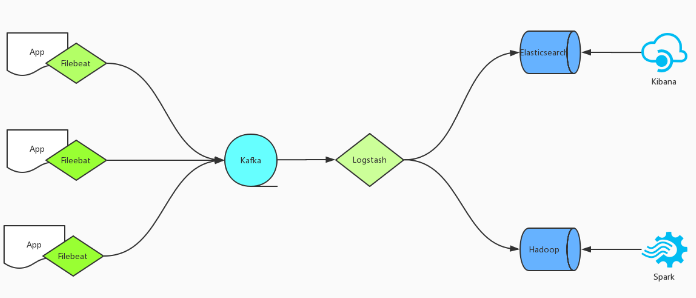
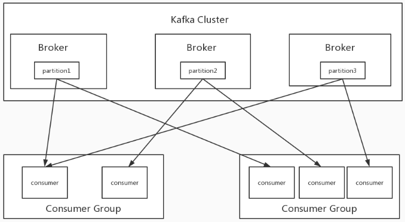

# Logstash——利用Kafka Group实现高可用

## <font style="color:rgb(0, 0, 0);">日志架构</font>



<font style="color:rgb(0, 0, 0);">所有日志由Rsyslog或者Filebeat收集，然后传输给Kafka，Logstash作为Consumer消费Kafka里边的数据，分别写入Elasticsearch和Hadoop，最后使用Kibana输出到web端供相关人员查看，或者是由Spark接手进入更深层次的分析。</font>

<font style="color:rgb(0, 0, 0);">在以上整个架构中，核心的几个组件Kafka、Elasticsearch、Hadoop天生支持高可用，唯独Logstash是不支持的，</font><font style="color:rgb(255, 0, 0);">用单个Logstash去处理日志，不仅存在处理瓶颈更重要的是在整个系统中存在单点的问题</font><font style="color:rgb(0, 0, 0);">，</font>

<font style="color:rgb(0, 0, 0);">如果Logstash宕机则将会导致整个集群的不可用，后果可想而知。</font>

<font style="color:rgb(0, 0, 0);">如何解决Logstash的单点问题呢？我们可以借助Kafka的Consumer Group来实现。</font>

<font style="color:rgb(0, 0, 0);"></font>

## <font style="color:rgb(0, 0, 0);">Kafka Consumer Group</font>

<font style="color:rgb(0, 0, 0);"></font>

**<font style="color:rgb(255, 0, 0);">Consumer Group：</font>**<font style="color:rgb(0, 0, 0);"> </font><font style="color:rgb(0, 0, 0);">是个逻辑上的概念，为一组consumer的集合，同一个topic的数据会广播给不同的group，同一个group中只有一个consumer能拿到这个数据。</font>

<font style="color:rgb(0, 0, 0);">也就是说对于同一个topic，</font><font style="color:rgb(255, 0, 0);">每个group都可以拿到同样的所有数据，但是数据进入group后只能被其中的一个consumer消费</font><font style="color:rgb(0, 0, 0);">，</font>

<font style="color:rgb(0, 0, 0);">基于这一点我们只需要启动多个logstsh，并将这些logstash分配在同一个组里边就可以实现logstash的高可用了。</font>

<font style="color:rgb(0, 0, 0);"></font>

## <font style="color:rgb(0, 0, 0);">配置</font>


```plain
input {
        kafka {
                bootstrap_servers => "172.x.x.91:9092,172.x.x.92:9092,172.x.x.93:9092"    #kafka集群地址
                group_id => "groupLog"    　  　　　　　　　　　　　　　　　　　　　　　　　　　　 #logstash集群消费kafka集群的身份标识，必须集群相同且唯一
                topics => ["logstash-log"]   　　　　　　　　　　　　　　　　　　　　　　　　　　　#要消费的kafka主题，logstash集群相同
                consumer_threads => 6        　　　　　　　　　　　　　　　　　　　　　　　　　　  #消费线程数，集群中所有logstash相加最好等于 topic 分区数
                auto_offset_reset => "latest"
                decorate_events => true
                type => "app_log"
                codec => json
        }
}
```


<font style="color:rgb(0, 0, 0);">以上为logstash消费kafka集群的配置，其中加入了</font><code><font style="color:rgb(192, 52, 29);background-color:rgb(251, 229, 225);">group_id</font></code><font style="color:rgb(0, 0, 0);">参数，</font><code><font style="color:rgb(192, 52, 29);background-color:rgb(251, 229, 225);">group_id</font></code><font style="color:rgb(0, 0, 0);">是一个的字符串，唯一标识一个group，具有相同</font><code><font style="color:rgb(192, 52, 29);background-color:rgb(251, 229, 225);">group_id</font></code><font style="color:rgb(0, 0, 0);">的consumer构成了一个consumer group，</font>

<font style="color:rgb(0, 0, 0);">这样启动多个logstash进程，只需要保证</font><code><font style="color:rgb(192, 52, 29);background-color:rgb(251, 229, 225);">group_id</font></code><font style="color:rgb(0, 0, 0);">一致就能达到logstash高可用的目的，一个logstash挂掉同一Group内的logstash可以继续消费。</font>

<font style="color:rgb(0, 0, 0);">除了高可用外同一Group内的多个Logstash可以同时消费kafka内topic的数据，从而提高logstash的处理能力，但需要注意的是消费kafka数据时，</font>

<font style="color:rgb(0, 0, 0);">每个consumer最多只能使用一个partition，当一个Group内consumer的数量大于partition的数量时，</font><font style="color:rgb(255, 0, 0);">只有等于partition个数的consumer能同时消费，其他的consumer处于等待状态。</font>

<font style="color:rgb(0, 0, 0);">例如一个topic下有3个partition，那么在一个有5个consumer的group中只有3个consumer在同时消费topic的数据，而另外两个consumer处于等待状态，</font>

<font style="color:rgb(0, 0, 0);">所以想要增加logstash的消费性能，可以适当的增加topic的partition数量，但kafka中partition数量过多也会导致kafka集群故障恢复时间过长，</font>

<font style="color:rgb(0, 0, 0);">消耗更多的文件句柄与客户端内存等问题，也并不是partition配置越多越好，需要在使用中找到一个平衡。</font>

<font style="color:rgb(0, 0, 0);"></font>

## <font style="color:rgb(0, 0, 0);">配置说明</font>

**<font style="color:rgb(0, 0, 0);">1、codec （反序列化JSON）</font>**

<font style="color:rgb(0, 0, 0);">es是按照json格式存储数据的，上面的例子中，我们输入到kafka的数据是json格式的，但是经Logstash写入到es之后，整条数据变成一个字符串存储到</font><code><font style="color:rgb(192, 52, 29);background-color:rgb(251, 229, 225);">message</font></code><font style="color:rgb(0, 0, 0);">字段里面了。</font>

<font style="color:rgb(0, 0, 0);">如果我们想要保持原来的json格式写入到es，只需要在input里面再加一条配置项：</font><code><font style="color:rgb(192, 52, 29);background-color:rgb(251, 229, 225);">codec => "json"</font></code><font style="color:rgb(0, 0, 0);">.</font>

<font style="color:rgb(0, 0, 0);"></font>

**<font style="color:rgb(0, 0, 0);">2、consumer\_threads（并行传输）</font>**

<font style="color:rgb(0, 0, 0);">Logstash的input读取数的时候可以多线程并行读取，</font><code><font style="color:rgb(192, 52, 29);background-color:rgb(251, 229, 225);">logstash-input-kafka</font></code><font style="color:rgb(0, 0, 0);">插件中对应的配置项是</font><code><font style="color:rgb(192, 52, 29);background-color:rgb(251, 229, 225);">consumer_threads</font></code><font style="color:rgb(0, 0, 0);">，默认值为1。一般这个默认值不是最佳选择，那这个值该配置多少呢？这个需要对kafka的模型有一定了解：</font>

* <font style="color:rgb(0, 0, 0);">kafka的topic是分区的，数据存储在每个分区内；</font>
* <font style="color:rgb(0, 0, 0);">kafka的consumer是分组的，任何一个consumer属于某一个组，一个组可以包含多个consumer，同一个组内的consumer不会重复消费的同一份数据。</font>

<font style="color:rgb(0, 0, 0);">所以，对于kafka的consumer，一般最佳配置是</font>**<font style="color:rgb(0, 0, 0);">同一个组内consumer个数（或线程数）等于topic的分区数</font>**<font style="color:rgb(0, 0, 0);">，这样consumer就会均分topic的分区，达到比较好的均衡效果。</font>

<font style="color:rgb(0, 0, 0);">举个例子，比如一个topic有n个分区，consumer有m个线程。那最佳场景就是n=m，此时一个线程消费一个分区。如果n小于m，即线程数多于分区数，那多出来的线程就会空闲。</font>

<font style="color:rgb(0, 0, 0);">如果n大于m，那就会存在一些线程同时消费多个分区的数据，造成线程间负载不均衡。</font>

<font style="color:rgb(0, 0, 0);">所以，一般</font><code><font style="color:rgb(192, 52, 29);background-color:rgb(251, 229, 225);">consumer_threads</font></code><font style="color:rgb(0, 0, 0);">配置为你消费的topic的所包含的partition个数即可。如果有多个Logstash实例，那就让</font><code><font style="color:rgb(192, 52, 29);background-color:rgb(251, 229, 225);">实例个数 * consumer_threads</font></code><font style="color:rgb(0, 0, 0);">等于分区数即可。</font>

<font style="color:rgb(0, 0, 0);">没有配置</font><code><font style="color:rgb(192, 52, 29);background-color:rgb(251, 229, 225);">consumer_threads</font></code><font style="color:rgb(0, 0, 0);">，使用默认值1，可以在Logstash中看到如下日志：</font>

<font style="color:rgb(0, 0, 0);background-color:rgb(245, 245, 245);">\[2019-09-19T22:54:48,207]\[INFO ]\[org.apache.kafka.clients.consumer.internals.ConsumerCoordinator] \[Consumer clientId=logstash-0, groupId=logstash] Setting newly assigned partitions \[nyc-test-1, nyc-test-0]</font>

<font style="color:rgb(0, 0, 0);">因为只有一个consumer，所以两个分区都分给了它。这次我们将</font><code><font style="color:rgb(192, 52, 29);background-color:rgb(251, 229, 225);">consumer_threads</font></code><font style="color:rgb(0, 0, 0);">设置成了2，看下效果：</font>

```plain
[2019-09-19T23:23:52,981][INFO ][org.apache.kafka.clients.consumer.internals.ConsumerCoordinator] [Consumer clientId=logstash-0, groupId=logstash] Setting newly assigned partitions [nyc-test-0]
[2019-09-19T23:23:52,982][INFO ][org.apache.kafka.clients.consumer.internals.ConsumerCoordinator] [Consumer clientId=logstash-1, groupId=logstash] Setting newly assigned partitions [nyc-test-1]
```

<font style="color:rgb(0, 0, 0);">有两个线程，即两个consumer，所以各分到一个partition。</font>

<font style="color:rgb(0, 0, 0);"></font>

**<font style="color:rgb(0, 0, 0);">3、如何避免重复数据</font>**

<font style="color:rgb(0, 0, 0);">有些业务场景可能不能忍受重复数据，有一些配置项可以帮我们在一定程度上解决问题。这里需要先梳理一下可能造成重复数据的场景：</font>

* <font style="color:rgb(0, 0, 0);">数据产生的时候就有重复，业务想对重复数据去重（注意是去重，不是merge）。</font>
* <font style="color:rgb(0, 0, 0);">数据写入到Kafka时没有重复，但后续流程可能因为网络抖动、传输失败等导致重试造成数据重复。</font>

<font style="color:rgb(0, 0, 0);">对于第1种场景，只要原始数据中有唯一字段就可以去重；对于第2种场景，不需要依赖业务数据就可以去重。去重的原理也很简单，利用es document id即可。</font>

<font style="color:rgb(0, 0, 0);">对于es，如果写入数据时没有指定document id，就会随机生成一个uuid，如果指定了，就使用指定的值。对于需要去重的场景，我们指定document id即可。</font>

<font style="color:rgb(0, 0, 0);">在output elasticsearch中可以通过</font><code><font style="color:rgb(192, 52, 29);background-color:rgb(251, 229, 225);">document_id</font></code><font style="color:rgb(0, 0, 0);">字段指定document id。对于场景1非常简单，指定业务中的惟一字段为document id即可。主要看下场景2。</font>

<font style="color:rgb(0, 0, 0);">对于场景2，我们需要构造出一个“uuid”能惟一标识kafka中的一条数据，这个也非常简单：</font><code><font style="color:rgb(192, 52, 29);background-color:rgb(251, 229, 225);"><topic>+<partition>+<offset></font></code><font style="color:rgb(0, 0, 0);">，这三个值的组合就可以惟一标识kafka集群中的一条数据。</font>

<font style="color:rgb(0, 0, 0);">input kafka插件也已经帮我们把消息对应的元数据信息记录到了</font><code><font style="color:rgb(192, 52, 29);background-color:rgb(251, 229, 225);">@metadata</font></code><font style="color:rgb(0, 0, 0);">（Logstash的元数据字段，不会输出到output里面去）字段里面：</font>

* <code><font style="color:rgb(192, 52, 29);background-color:rgb(251, 229, 225);">[@metadata][kafka][topic]</font></code><font style="color:rgb(0, 0, 0);">：索引信息</font>
* <code><font style="color:rgb(192, 52, 29);background-color:rgb(251, 229, 225);">[@metadata][kafka][consumer_group]</font></code><font style="color:rgb(0, 0, 0);">：消费者组信息</font>
* <code><font style="color:rgb(192, 52, 29);background-color:rgb(251, 229, 225);">[@metadata][kafka][partition]</font></code><font style="color:rgb(0, 0, 0);">：分区信息</font>
* <code><font style="color:rgb(192, 52, 29);background-color:rgb(251, 229, 225);">[@metadata][kafka][offset]</font></code><font style="color:rgb(0, 0, 0);">：offset信息</font>
* <code><font style="color:rgb(192, 52, 29);background-color:rgb(251, 229, 225);">[@metadata][kafka][key]</font></code><font style="color:rgb(0, 0, 0);">：消息的key（如果有的话）</font>
* <code><font style="color:rgb(192, 52, 29);background-color:rgb(251, 229, 225);">[@metadata][kafka][timestamp]</font></code><font style="color:rgb(0, 0, 0);">：时间戳信息（消息创建的时间或者broker收到的时间）</font>

<font style="color:rgb(0, 0, 0);">所以，就可以这样配置document id了：</font>

<font style="color:rgb(0, 0, 0);background-color:rgb(245, 245, 245);">document\_id => "%{\[@metadata]\[kafka]\[topic]}-%{\[@metadata]\[kafka]\[partition]}-%{\[@metadata]\[kafka]\[offset]}"</font>

<font style="color:rgb(0, 0, 0);">当然，如果每条kafka消息都有一个唯一的uuid的话，也可以在写入kafka的时候，将其写为key，然后这里就可以使用</font><code><font style="color:rgb(192, 52, 29);background-color:rgb(251, 229, 225);">[@metadata][kafka][key]</font></code><font style="color:rgb(0, 0, 0);">作为document id了。</font>

<font style="color:rgb(0, 0, 0);">最后一定要注意，</font>**<font style="color:rgb(0, 0, 0);">只有当</font>**<code>**<font style="color:rgb(192, 52, 29);background-color:rgb(251, 229, 225);">decorate_events</font>**</code>**<font style="color:rgb(0, 0, 0);">选项配置为true的时候，上面的@metadata才会记录那些元数据，否则不会记录。而该配置项的默认值是false，即不记录。</font>**

<font style="color:rgb(0, 0, 0);"></font>

**<font style="color:rgb(0, 0, 0);">4、</font>\*\*\*\*<font style="color:rgb(0, 0, 0);">auto\_offset\_reset</font>**

<font style="color:rgb(0, 0, 0);">Kafka中没有初始偏移量或偏移量超出范围时该怎么办：</font>

* <font style="color:rgb(0, 0, 0);">earliest：将偏移量自动重置为最早的偏移量</font>
* <font style="color:rgb(0, 0, 0);">latest：自动将偏移量重置为最新偏移量</font>
* <font style="color:rgb(0, 0, 0);">none：如果未找到消费者组的先前偏移量，则向消费者抛出异常</font>

<font style="color:rgb(0, 0, 0);"></font>


> 更新: 2024-08-29 19:57:07  
> 原文: <https://www.yuque.com/zilin-hw8cn/po91to/qxmgdan4edq0kgos>