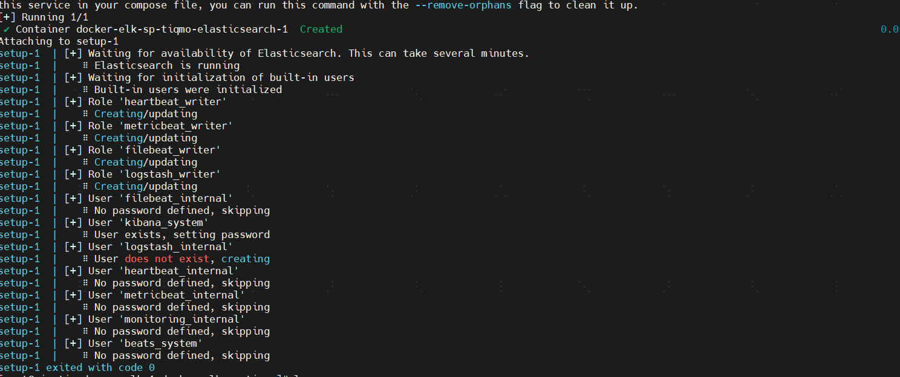

# docker compose安装elk集群

# 配置linux(redhat)内核参数

/etc/sysctl.conf

vm.max\_map\_count=262144

<font style="color:rgba(0, 0, 0, 0.5);background-color:rgba(27, 31, 35, 0.05);">sysctl -p</font>

:::color4
（本次es高可用节点有三个所以三台机器都要修改）

:::

# 授权普通用户

sudo usermod -aG docker $USER

sudo usermod -aG root $USER

# 安装es高可用集群(es1,es2.es3)

## 拉取 elk开源项目,分别放到三个es节点

git clone <https://github.com/deviantony/docker-elk/>

修改项目.env的环境变量密码

修改环境变量.env

:::info
ELASTIC\_VERSION=8.7.0

## Passwords for stack users

#

# User 'elastic' (built-in)

#

# Superuser role, full access to cluster management and data indices.

# <https://www.elastic.co/guide/en/elasticsearch/reference/current/built-in-users.html>

ELASTIC\_PASSWORD='YbW8Yp5o26niQ4ig6uYq'

# User 'logstash\_internal' (custom)

#

# The user Logstash uses to connect and send data to Elasticsearch.

# <https://www.elastic.co/guide/en/logstash/current/ls-security.html>

LOGSTASH\_INTERNAL\_PASSWORD='fX7p5FhT1jVt0T13Hten'

# User 'kibana\_system' (built-in)

#

# The user Kibana uses to connect and communicate with Elasticsearch.

# <https://www.elastic.co/guide/en/elasticsearch/reference/current/built-in-users.html>

KIBANA\_SYSTEM\_PASSWORD='O219VDBdvddmICehtVJl'

# Users 'metricbeat\_internal', 'filebeat\_internal' and 'heartbeat\_internal' (custom)

#

# The users Beats use to connect and send data to Elasticsearch.

# <https://www.elastic.co/guide/en/beats/metricbeat/current/feature-roles.html>

METRICBEAT\_INTERNAL\_PASSWORD=''

FILEBEAT\_INTERNAL\_PASSWORD=''

HEARTBEAT\_INTERNAL\_PASSWORD=''

# User 'monitoring\_internal' (custom)

#

# The user Metricbeat uses to collect monitoring data from stack components.

# <https://www.elastic.co/guide/en/elasticsearch/reference/current/how-monitoring-works.html>

MONITORING\_INTERNAL\_PASSWORD=''

# User 'beats\_system' (built-in)

#

# The user the Beats use when storing monitoring information in Elasticsearch.

# <https://www.elastic.co/guide/en/elasticsearch/reference/current/built-in-users.html>

BEATS\_SYSTEM\_PASSWORD=''

root@cin-tiq-damm-p-elk-01:/home/mysqladmin/docker-elk-sp-tiqmo# cat .env

ELASTIC\_VERSION=8.7.0

## Passwords for stack users

#

# User 'elastic' (built-in)

#

# Superuser role, full access to cluster management and data indices.

# <https://www.elastic.co/guide/en/elasticsearch/reference/current/built-in-users.html>

ELASTIC\_PASSWORD='YbW8Yp5o26niQ4ig6uYq'

# User 'logstash\_internal' (custom)

#

# The user Logstash uses to connect and send data to Elasticsearch.

# <https://www.elastic.co/guide/en/logstash/current/ls-security.html>

LOGSTASH\_INTERNAL\_PASSWORD='fX7p5FhT1jVt0T13Hten'

# User 'kibana\_system' (built-in)

#

# The user Kibana uses to connect and communicate with Elasticsearch.

# <https://www.elastic.co/guide/en/elasticsearch/reference/current/built-in-users.html>

KIBANA\_SYSTEM\_PASSWORD='O219VDBdvddmICehtVJl'

# Users 'metricbeat\_internal', 'filebeat\_internal' and 'heartbeat\_internal' (custom)

#

# The users Beats use to connect and send data to Elasticsearch.

.....

:::

## 修改docker compose

es1 docker-compose.yml 如下

:::info
version: '3.7'

services:

# The 'setup' service runs a one-off script which initializes users inside

# Elasticsearch — such as 'logstash\_internal' and 'kibana\_system' — with the

# values of the passwords defined in the '.env' file. It also creates the

# roles required by some of these users.

#

# This task only needs to be performed once, during the *initial* startup of

# the stack. Any subsequent run will reset the passwords of existing users to

# the values defined inside the '.env' file, and the built-in roles to their

# default permissions.

#

# By default, it is excluded from the services started by 'docker compose up'

# due to the non-default profile it belongs to. To run it, either provide the

# '--profile=setup' CLI flag to Compose commands, or "up" the service by name

# such as 'docker compose up setup'.

setup:

```
profiles:

  - setup

build:

  context: setup/

  args:

    ELASTIC_VERSION: ${ELASTIC_VERSION}

init: true

volumes:

  - ./setup/entrypoint.sh:/entrypoint.sh:ro,Z

  - ./setup/lib.sh:/lib.sh:ro,Z

  - ./setup/roles:/roles:ro,Z

environment:

  ELASTIC_PASSWORD: ${ELASTIC_PASSWORD:-}

  LOGSTASH_INTERNAL_PASSWORD: ${LOGSTASH_INTERNAL_PASSWORD:-}

  KIBANA_SYSTEM_PASSWORD: ${KIBANA_SYSTEM_PASSWORD:-}

  METRICBEAT_INTERNAL_PASSWORD: ${METRICBEAT_INTERNAL_PASSWORD:-}

  FILEBEAT_INTERNAL_PASSWORD: ${FILEBEAT_INTERNAL_PASSWORD:-}

  HEARTBEAT_INTERNAL_PASSWORD: ${HEARTBEAT_INTERNAL_PASSWORD:-}

  MONITORING_INTERNAL_PASSWORD: ${MONITORING_INTERNAL_PASSWORD:-}

  BEATS_SYSTEM_PASSWORD: ${BEATS_SYSTEM_PASSWORD:-}
```

# networks:

# - elk

```
depends_on:

  - elasticsearch
```

elasticsearch:

```
build:

  context: elasticsearch/

  args:

    ELASTIC_VERSION: ${ELASTIC_VERSION}

volumes:

  - ./elasticsearch/config/elasticsearch.yml:/usr/share/elasticsearch/config/elasticsearch.yml:ro,Z

  - /data/elasticsearch/elasticsearch_data:/usr/share/elasticsearch/data:Z

  - ./ca/ca/elastic-stack-ca.p12:/usr/share/elasticsearch/config/elastic-stack-ca.p12:ro

  - ./ca/ca/elastic-certificates.p12:/usr/share/elasticsearch/config/elastic-certificates.p12:ro

ports:

  - 9200:9200

  - 9300:9300

environment:

  node.name: elasticsearch01

  ES_JAVA_OPTS: -Xms6192m -Xmx6192m

  # Bootstrap password.

  # Used to initialize the keystore during the initial startup of

  # Elasticsearch. Ignored on subsequent runs.

  ELASTIC_PASSWORD: ${ELASTIC_PASSWORD:-}

  discovery.seed_hosts: 10.21.104.4,10.21.104.5

  cluster.initial_master_nodes: "10.21.104.3,10.21.104.4,10.21.104.5"

  # Use single node discovery in order to disable production mode and avoid bootstrap checks.

  # see: [https://www.elastic.co/guide/en/elasticsearch/reference/current/bootstrap-checks.html](https://www.elastic.co/guide/en/elasticsearch/reference/current/bootstrap-checks.html)

  #discovery.type: single-node
```

# networks:

# - elk

```
restart: unless-stopped
```

logstash:

```
build:

  context: logstash/

  args:

    ELASTIC_VERSION: ${ELASTIC_VERSION}

volumes:

  - ./logstash/config/logstash.yml:/usr/share/logstash/config/logstash.yml:ro,Z

  - ./logstash/pipeline:/usr/share/logstash/pipeline:ro,Z

ports:

  - 5044:5044

  - 50000:50000/tcp

  - 50000:50000/udp

  - 9600:9600

environment:

  LS_JAVA_OPTS: -Xms256m -Xmx2048m

  LOGSTASH_INTERNAL_PASSWORD: ${LOGSTASH_INTERNAL_PASSWORD:-}
```

# networks:

# - elk

```
depends_on:

  - elasticsearch

restart: unless-stopped
```

kibana:

```
build:

  context: kibana/

  args:

    ELASTIC_VERSION: ${ELASTIC_VERSION}

volumes:

  - ./kibana/config/kibana.yml:/usr/share/kibana/config/kibana.yml:ro,Z

ports:

  - 5601:5601

environment:

  KIBANA_SYSTEM_PASSWORD: ${KIBANA_SYSTEM_PASSWORD:-}
```

# networks:

# - elk

```
depends_on:

  - elasticsearch

restart: unless-stopped
```

\#networks:

# elk:

# driver: bridge

\#volumes:

# elasticsearch:

:::

es2的 docker-compose.yml如下

:::info
version: '3.7'

services:

elasticsearch02:

```
build:

  context: elasticsearch/

  args:

    ELASTIC_VERSION: ${ELASTIC_VERSION}

volumes:

  - ./elasticsearch/config/elasticsearch.yml:/usr/share/elasticsearch/config/elasticsearch.yml:ro,Z

  - /data/elasticsearch02/elasticsearch_data:/usr/share/elasticsearch/data:Z

  - ./ca/ca/elastic-stack-ca.p12:/usr/share/elasticsearch/config/elastic-stack-ca.p12:ro

  - ./ca/ca/elastic-certificates.p12:/usr/share/elasticsearch/config/elastic-certificates.p12:ro

ports:

  - 9200:9200

  - 9300:9300

environment:

  node.name: elasticsearch02

  ES_JAVA_OPTS: -Xms8192m -Xmx8192m

  # Bootstrap password.

  # Used to initialize the keystore during the initial startup of

  # Elasticsearch. Ignored on subsequent runs.

  ELASTIC_PASSWORD: ${ELASTIC_PASSWORD:-}

  discovery.seed_hosts: 10.21.104.3,10.21.104.5

  cluster.initial_master_nodes: "10.21.104.3,10.21.104.4,10.21.104.5"

  # Use single node discovery in order to disable production mode and avoid bootstrap checks.

  # see: [https://www.elastic.co/guide/en/elasticsearch/reference/current/bootstrap-checks.html](https://www.elastic.co/guide/en/elasticsearch/reference/current/bootstrap-checks.html)
```

# discovery.type: single-node

# networks:

# - elk

```
restart: unless-stopped
```

:::

## es三个节点创建持久化数据目录

/data/elasticsearch02/elasticsearch\_data/

chmod 777 /data/\*/elasticsearch\_data/

## 修改es三个节点的配置文件

es1: elasticsearch/config/elasticsearch.yml

## :::color4

## Default Elasticsearch configuration from Elasticsearch base image.

## <https://github.com/elastic/elasticsearch/blob/main/distribution/docker/src/docker/config/elasticsearch.yml>

#

cluster.name: docker-cluster-tiqmo

transport.publish\_host : 10.21.104.3

network.host: 0.0.0.0

http.cors.enabled : true

http.cors.allow-origin : "\*"

## X-Pack settings

## see <https://www.elastic.co/guide/en/elasticsearch/reference/current/security-settings.html>

#

xpack.license.self\_generated.type: trial

xpack.security.enabled: true

xpack.security.transport.ssl.enabled: true

xpack.security.transport.ssl.verification\_mode: certificate

xpack.security.transport.ssl.keystore.path: elastic-certificates.p12

xpack.security.transport.ssl.truststore.path: elastic-certificates.p12

:::

es2: elasticsearch/config/elasticsearch.yml

## :::color4

## Default Elasticsearch configuration from Elasticsearch base image.

## <https://github.com/elastic/elasticsearch/blob/main/distribution/docker/src/docker/config/elasticsearch.yml>

#

cluster.name: docker-cluster-tiqmo

transport.publish\_host : 10.21.104.4

network.host: 0.0.0.0

http.cors.enabled : true

http.cors.allow-origin : "\*"

## X-Pack settings

## see <https://www.elastic.co/guide/en/elasticsearch/reference/current/security-settings.html>

#

xpack.license.self\_generated.type: trial

xpack.security.enabled: true

xpack.security.transport.ssl.enabled: true

xpack.security.transport.ssl.verification\_mode: certificate

xpack.security.transport.ssl.keystore.path: elastic-certificates.p12

xpack.security.transport.ssl.truststore.path: elastic-certificates.p12

:::

es3 elasticsearch/config/elasticsearch.yml

## :::info

## Default Elasticsearch configuration from Elasticsearch base image.

## <https://github.com/elastic/elasticsearch/blob/main/distribution/docker/src/docker/config/elasticsearch.yml>

#

cluster.name: docker-cluster-tiqmo

transport.publish\_host : 10.21.104.5

network.host: 0.0.0.0

http.cors.enabled : true

http.cors.allow-origin : "\*"

## X-Pack settings

## see <https://www.elastic.co/guide/en/elasticsearch/reference/current/security-settings.html>

#

xpack.license.self\_generated.type: trial

xpack.security.enabled: true

xpack.security.transport.ssl.enabled: true

xpack.security.transport.ssl.verification\_mode: certificate

xpack.security.transport.ssl.keystore.path: elastic-certificates.p12

xpack.security.transport.ssl.truststore.path: elastic-certificates.p12

:::

# es部署顺序 (重点)

## 1.用docker先部署一个es，生成证书

## 将证书拷贝到es三个节点的对应目录

确保ca证书和elk服务config文件的权限是644

创建数据elk目录,授予权限chmod 777 -R /data/

## 仅在es01创建 /data/apm-server和/data/apm-server

chmod 777 -R /data/apm-server

chmod 777 -R  /data/fleet-server/

## 2.docker compose部署 es1,es2，es3

分别在es2 和es3

**上执行docker compose up -d (部署elasticsearch和 logstash)**

:::danger
**重要：等待es2 和es3部署elasticsearch成功后,再到es1节点上部署**

:::

## 3.es1节点上部署elasticstack组件的具体步骤

### 1.初始化 setup（一定要确保这一步执行成功）

**等待es2和es3的elasticsearch组件部署成功后再执行，初始化操作**

> \*\* elasticsearch/config/elasticsearch.yml的配置不要填写错\*\*

```bash
docker compose up setup
```

执行成功的截图如下



:::info <font style="color:#DF2A3F;">如果 setup的步骤有错，请检查es配置!!!</font>

:::

### 2.修改kibana和logstash配置文件，执行docker compose

root@cin-tiq-damm-p-elk-01:/home/mysqladmin# cat docker-elk-sp-tiqmo/kibana/config/kibana.yml

***

:::info

## Default Kibana configuration from Kibana base image.

## <https://github.com/elastic/kibana/blob/main/src/dev/build/tasks/os_packages/docker_generator/templates/kibana_yml.template.ts>

#

server.name: kibana

server.host: 0.0.0.0

elasticsearch.hosts: \[ http://10.21.104.3:9200,http://10.21.104.4:9200,http://10.21.104.5:9200 ]

monitoring.ui.container.elasticsearch.enabled: true

monitoring.ui.container.logstash.enabled: true

## X-Pack security credentials

#

elasticsearch.username: kibana\_system

elasticsearch.password: ${KIBANA\_SYSTEM\_PASSWORD}

\#elasticsearch.username: elastic

\#elasticsearch.password: 'YbW8Yp5o26niQ4ig6uYq'

## Encryption keys (optional but highly recommended)

##

## Generate with either

## $ docker container run --rm docker.elastic.co/kibana/kibana:8.6.2 bin/kibana-encryption-keys generate

## $ openssl rand -hex 32

##

## <https://www.elastic.co/guide/en/kibana/current/using-kibana-with-security.html>

## <https://www.elastic.co/guide/en/kibana/current/kibana-encryption-keys.html>

#

xpack.security.encryptionKey: 3db03b08a687ee7c04e711b09c1ec0b960118d1c7c5b4f30a4f84651eef86e04

xpack.encryptedSavedObjects.encryptionKey: 3db03b08a687ee7c04e711b09c1ec0b960118d1c7c5b4f30a4f84651eef86e04

xpack.reporting.encryptionKey: 3db03b08a687ee7c04e711b09c1ec0b960118d1c7c5b4f30a4f84651eef86e04

## Fleet

## <https://www.elastic.co/guide/en/kibana/current/fleet-settings-kb.html>

#

xpack.fleet.agents.fleet\_server.hosts: \[ <http://fleet-server:8220> ]

xpack.fleet.outputs:

* id: fleet-default-output

  name: default

  type: elasticsearch

  hosts: \[ http://10.21.104.3:9200,http://10.21.104.4:9200,http://10.21.104.5:9200 ]

  is\_default: true

  is\_default\_monitoring: true

xpack.fleet.packages:

* name: fleet\_server

  version: latest

* name: system

  version: latest

* name: elastic\_agent

  version: latest

* name: apm

  version: latest

xpack.fleet.agentPolicies:

* name: Fleet Server Policy

  id: fleet-server-policy

  description: Static agent policy for Fleet Server

  monitoring\_enabled:

  * logs

  * metrics

  package\_policies:

  * name: fleet\_server-1

    package:

    name: fleet\_server

  * name: system-1

    package:

    name: system

  * name: elastic\_agent-1

    package:

    name: elastic\_agent

* name: Agent Policy APM Server

  id: agent-policy-apm-server

  description: Static agent policy for the APM Server integration

  monitoring\_enabled:

  * logs

  * metrics

  package\_policies:

  * name: system-1

    package:

    name: system

  * name: elastic\_agent-1

    package:

    name: elastic\_agent

  * name: apm-1

    package:

    name: apm

    # See the APM package manifest for a list of possible inputs.

    # <https://github.com/elastic/apm-server/blob/v8.5.0/apmpackage/apm/manifest.yml#L41-L168>

    inputs:

    * type: apm

      vars:

      * name: host

        value: 0.0.0.0:8200

      * name: url

        value: <http://0.0.0.0:8200>

:::

root@cin-tiq-damm-p-elk-01:/home/mysqladmin# cat docker-elk-sp-tiqmo/logstash/config/logstash.yml

## :::info

## Default Logstash configuration from Logstash base image.

## <https://github.com/elastic/logstash/blob/main/docker/data/logstash/config/logstash-full.yml>

#

http.host: 0.0.0.0

node.name: logstash

\#pipeline:

# id: pipeline-tiqmo

xpack.management.enabled: true

xpack.management.elasticsearch.hosts: \[ "http://10.21.104.3:9200","http://10.21.104.4:9200","http://10.21.104.5:9200" ]

\#xpack.management.elasticsearch.username: "elastic"

\#xpack.management.elasticsearch.password: "YbW8Yp5o26niQ4ig6uYq"

xpack.management.elasticsearch.username: "logstash\_internal"

xpack.management.elasticsearch.password: "${LOGSTASH\_INTERNAL\_PASSWORD}"

xpack.management.logstash.poll\_interval: 5s

xpack.management.pipeline.id: \["tiqmo-\*"]

:::

docker compose -f docker-compose.yml up -d

## 4. 部署fleet和apm

先创建 data/fleet-server和/data/apm目录

docker compose -f docker-compose.yml -f extensions/fleet/fleet-compose.yml up -d

docker compose -f docker-compose.yml -f extensions/fleet/fleet-compose.yml -f extensions/fleet/agent-apmserver-compose.yml up -d

apm config配置：

root@cin-tiq-damm-p-elk-01:/home/mysqladmin/docker-elk-sp-tiqmo/extensions/fleet# cat config/apm-server.yaml

:::info
\######################### APM Server Configuration #########################

\################################ APM Server ################################

apm-server:

# Defines the host and port the server is listening on. Use "unix:/path/to.sock" to listen on a unix domain socket.

host: "0.0.0.0:8200"

\#---------------------------- APM Server - Agent Configuration ----------------------------

# When using APM agent configuration, information fetched from Kibana will be cached in memory for some time.

# Specify cache key expiration via this setting. Default is 30 seconds.

\#agent.config.cache.expiration: 30s

kibana:

```
enabled: true

host: "10.21.104.3:5601"

username: "elastic"

password: "YbW8Yp5o26niQ4ig6uYq"
```

\#================================ Outputs =================================

# Configure the output to use when sending the data collected by apm-server.

\#-------------------------- Elasticsearch output --------------------------

output.elasticsearch:

# Array of hosts to connect to.

# Scheme and port can be left out and will be set to the default (`http` and `9200`).

# In case you specify and additional path, the scheme is required: `[http://localhost:9200/path`.]\(http://localhost:9200/path\`.)

# IPv6 addresses should always be defined as: `https://[2001:db8::1]:9200`.

enabled: true

hosts: \["10.21.104.3:9200","10.21.104.4:9200","10.21.104.5:9200"]

username: "elastic"

password: "YbW8Yp5o26niQ4ig6uYq"

worker: 4

bulk\_max\_size: 4096

queue.mem:

events: 16384

rum:

enabled: true

:::

fleet docker compose

root@cin-tiq-damm-p-elk-01:/home/mysqladmin/docker-elk-sp-tiqmo/extensions/fleet# cat fleet-compose.yml

:::info
version: '3.7'

services:

fleet-server:

```
build:

  context: extensions/fleet/

  args:

    ELASTIC_VERSION: ${ELASTIC_VERSION}

volumes:

  - /data/fleet-server:/usr/share/elastic-agent/state:Z

environment:

  FLEET_SERVER_ENABLE: '1'

  FLEET_SERVER_INSECURE_HTTP: '1'

  FLEET_SERVER_HOST: 0.0.0.0

  FLEET_SERVER_POLICY_ID: fleet-server-policy

  # Fleet plugin in Kibana

  KIBANA_FLEET_SETUP: '1'

  # Enrollment.

  # (a) Auto-enroll using basic authentication

  ELASTICSEARCH_USERNAME: elastic

  ELASTICSEARCH_PASSWORD: YbW8Yp5o26niQ4ig6uYq

  #ELASTICSEARCH_PASSWORD: ${ELASTIC_PASSWORD:-}

  # (b) Enroll using a pre-generated service token

  #FLEET_SERVER_SERVICE_TOKEN: <service_token>

ports:

  - 8220:8220

hostname: fleet-server

# Elastic Agent does not retry failed connections to Kibana upon the initial enrollment phase.

restart: on-failure
```

# networks:

# - elk

# depends\_on:

# - elasticsearch

# - kibana

\#volumes:

# fleet-server:

:::

apm-docker-compose.yaml

:::info
version: '3.7'

# Example of Fleet-enrolled Elastic Agent pre-configured with an agent policy

# for running the APM Server integration (see kibana.yml).

#

# Run with

# docker-compose \\

# -f docker-compose.yml \\

# -f extensions/fleet/fleet-compose.yml \\

# -f extensions/fleet/agent-apmserver-compose.yml \\

# up

services:

apm-server:

```
build:

  context: extensions/fleet/

  args:

    ELASTIC_VERSION: ${ELASTIC_VERSION}

volumes:

  - /data/apm-server:/usr/share/elastic-agent/state:Z

environment:

  FLEET_ENROLL: '1'

  FLEET_TOKEN_POLICY_NAME: Agent Policy APM Server

  FLEET_INSECURE: '1'

  FLEET_URL: [http://fleet-server:8220](http://fleet-server:8220)

  # Enrollment.

  # (a) Auto-enroll using basic authentication

  ELASTICSEARCH_USERNAME: elastic

  ELASTICSEARCH_PASSWORD: ${ELASTIC_PASSWORD:-}

  # (b) Enroll using a pre-generated enrollment token

  #FLEET_ENROLLMENT_TOKEN: <enrollment_token>

ports:

  - 8200:8200

hostname: apm-server

# Elastic Agent does not retry failed connections to Kibana upon the initial enrollment phase.

restart: on-failure

#networks:

#  - elk

depends_on:

  - elasticsearch

  - kibana

 #- fleet-server
```

\#volumes:

# apm-server:

:::


> 更新: 2026-03-13 19:35:53  
> 原文: <https://www.yuque.com/zilin-hw8cn/po91to/ozlkkaw5dl2irvp7>