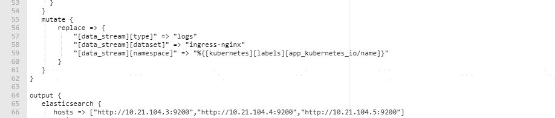
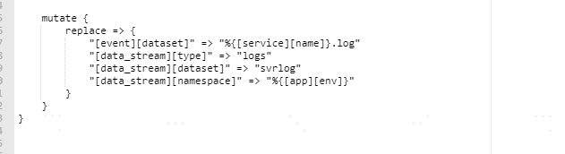
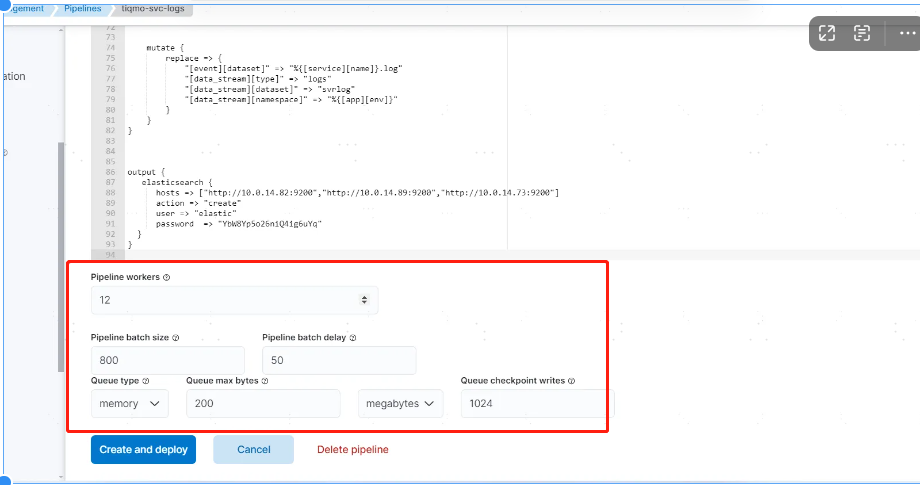

# kafka集群和三节点logstash实现ELK高可用

# 0.下载 bitnami官方 kafka docker compose

<https://github.com/bitnami/containers/blob/main/bitnami/kafka/docker-compose-cluster.yml>

# 1.将docker compose拆分成3份

node1

root@cin-tiq-damm-p-elk-01:/home/mysqladmin/kafka# cat docker-compose.yaml

:::info
version: "2"

services:\
kafka-0:\
hostname: kafka-server-0\
image: docker.io/bitnami/kafka:3.8\
ports:\
\- 9092:9092\
\- 9093:9093\
environment:\
\# KRaft settings\
\- KAFKA\_CFG\_NODE\_ID=0\
\- KAFKA\_CFG\_PROCESS\_ROLES=controller,broker\
\- KAFKA\_CFG\_CONTROLLER\_QUORUM\_VOTERS=0@10.21.104.3:9093,1@10.21.104.4:9093,2@10.21.104.5:9093\
\- KAFKA\_KRAFT\_CLUSTER\_ID=abcdefghijklmnopqrstuv\
\# Listeners\
\- KAFKA\_CFG\_LISTENERS=PLAINTEXT://:9092,CONTROLLER://:9093\
\- KAFKA\_CFG\_ADVERTISED\_LISTENERS=PLAINTEXT://10.21.104.3:9092\
\- KAFKA\_CFG\_LISTENER\_SECURITY\_PROTOCOL\_MAP=PLAINTEXT:PLAINTEXT,CONTROLLER:PLAINTEXT\
\- KAFKA\_CFG\_CONTROLLER\_LISTENER\_NAMES=CONTROLLER\
\- KAFKA\_CFG\_INTER\_BROKER\_LISTENER\_NAME=PLAINTEXT\
\# Clustering\
\- KAFKA\_CFG\_OFFSETS\_TOPIC\_REPLICATION\_FACTOR=3\
\- KAFKA\_CFG\_TRANSACTION\_STATE\_LOG\_REPLICATION\_FACTOR=3\
\- KAFKA\_CFG\_TRANSACTION\_STATE\_LOG\_MIN\_ISR=2\
volumes:\
\- /data/kafka-0:/bitnami/kafka

:::

node2

:::info
version: "2"

services:

kafka-1:

```
hostname: kafka-server-1

image: docker.io/bitnami/kafka:3.8

ports:

  - 9092:9092

  - 9093:9093

environment:

  # KRaft settings

  - KAFKA_CFG_NODE_ID=1

  - KAFKA_CFG_PROCESS_ROLES=controller,broker

  - KAFKA_CFG_CONTROLLER_QUORUM_VOTERS=0@10.21.104.3:9093,1@10.21.104.4:9093,2@10.21.104.5:9093

  - KAFKA_KRAFT_CLUSTER_ID=abcdefghijklmnopqrstuv

  # Listeners

  - KAFKA_CFG_LISTENERS=PLAINTEXT://:9092,CONTROLLER://:9093

  - KAFKA_CFG_ADVERTISED_LISTENERS=PLAINTEXT://10.21.104.4:9092

  - KAFKA_CFG_LISTENER_SECURITY_PROTOCOL_MAP=PLAINTEXT:PLAINTEXT,CONTROLLER:PLAINTEXT

  - KAFKA_CFG_CONTROLLER_LISTENER_NAMES=CONTROLLER

  - KAFKA_CFG_INTER_BROKER_LISTENER_NAME=PLAINTEXT

  # Clustering

  - KAFKA_CFG_OFFSETS_TOPIC_REPLICATION_FACTOR=3

  - KAFKA_CFG_TRANSACTION_STATE_LOG_REPLICATION_FACTOR=3

  - KAFKA_CFG_TRANSACTION_STATE_LOG_MIN_ISR=2

volumes:

  - /data/kafka-1:/bitnami/kafka
```

:::

node3

:::info
version: "2"

services:

kafka-2:

```
hostname: kafka-server-2

image: docker.io/bitnami/kafka:3.8

ports:

  - 9092:9092

  - 9093:9093

environment:

  # KRaft settings

  - KAFKA_CFG_NODE_ID=2

  - KAFKA_CFG_PROCESS_ROLES=controller,broker

  - KAFKA_CFG_CONTROLLER_QUORUM_VOTERS=0@10.21.104.3:9093,1@10.21.104.4:9093,2@10.21.104.5:9093

  - KAFKA_KRAFT_CLUSTER_ID=abcdefghijklmnopqrstuv

  # Listeners

  - KAFKA_CFG_LISTENERS=PLAINTEXT://:9092,CONTROLLER://:9093

  - KAFKA_CFG_ADVERTISED_LISTENERS=PLAINTEXT://10.21.104.5:9092

  - KAFKA_CFG_LISTENER_SECURITY_PROTOCOL_MAP=PLAINTEXT:PLAINTEXT,CONTROLLER:PLAINTEXT

  - KAFKA_CFG_CONTROLLER_LISTENER_NAMES=CONTROLLER

  - KAFKA_CFG_INTER_BROKER_LISTENER_NAME=PLAINTEXT

  # Clustering

  - KAFKA_CFG_OFFSETS_TOPIC_REPLICATION_FACTOR=3

  - KAFKA_CFG_TRANSACTION_STATE_LOG_REPLICATION_FACTOR=3

  - KAFKA_CFG_TRANSACTION_STATE_LOG_MIN_ISR=2

volumes:

  - /data/kafka-2:/bitnami/kafka
```

:::

**特别注意：**

<font style="color:#DF2A3F;"> KAFKA\_CFG\_ADVERTISED\_LISTENERS=PLAINTEXT://10.21.104.4:9092 这个地址在使用非hostnetwork的时候需要显示指定，不然filebeat无法上送数据。</font>

<font style="color:#DF2A3F;"></font>

# 2.docker compose命令启动kafka

<font style="color:#DF2A3F;">按顺序启动：kafka-0>kafka-1->kafka-2</font>

<font style="color:#DF2A3F;">docker compose -f docker-compose.yaml up -d</font>

<font style="color:#DF2A3F;"></font>

# 3.进入kafka-0容器创建日志需要的topic

:::info
创建前端ingress-nginx topic（生产三个分区，2个副本）

<font style="color:rgb(56, 58, 66);">kafka-topics.sh --create --topic </font><font style="color:rgb(64, 120, 242);">ingress-nginx</font><font style="color:rgb(56, 58, 66);"> --bootstrap-server 127.0.0.1:9092 --partitions </font><font style="color:rgb(183, 107, 1);">3</font><font style="color:rgb(56, 58, 66);"> --replication-factor </font><font style="color:rgb(183, 107, 1);">3</font>

创建后端服务topic tiqmo-svrlog（生产三个分区，2个副本）

<font style="color:rgb(56, 58, 66);">kafka-topics.sh --create --topic </font><font style="color:rgb(64, 120, 242);">tiqmo-svrlog</font><font style="color:rgb(56, 58, 66);"> --bootstrap-server 127.0.0.1:9092 --partitions </font><font style="color:rgb(183, 107, 1);">3</font><font style="color:rgb(56, 58, 66);"> --replication-factor </font><font style="color:rgb(183, 107, 1);">3</font>

:::

# <font style="color:rgb(183, 107, 1);">4.三个节点分别安装logstash</font>

新增logstash docker compose示例

version: '3.7'

:::info
services:

elasticsearch03:

```
build:

  context: elasticsearch/

  args:

    ELASTIC_VERSION: ${ELASTIC_VERSION}

volumes:

  - ./elasticsearch/config/elasticsearch.yml:/usr/share/elasticsearch/config/elasticsearch.yml:ro,Z

  - /data/elasticsearch03/elasticsearch_data:/usr/share/elasticsearch/data:Z

  - ./ca/ca/elastic-stack-ca.p12:/usr/share/elasticsearch/config/elastic-stack-ca.p12:ro

  - ./ca/ca/elastic-certificates.p12:/usr/share/elasticsearch/config/elastic-certificates.p12:ro

ports:

  - 9200:9200

  - 9300:9300

environment:

  node.name: elasticsearch03

  ES_JAVA_OPTS: -Xms8192m -Xmx8192m

  # Bootstrap password.

  # Used to initialize the keystore during the initial startup of

  # Elasticsearch. Ignored on subsequent runs.

  ELASTIC_PASSWORD: ${ELASTIC_PASSWORD:-}

  discovery.seed_hosts: 10.21.104.3,10.21.104.4

  cluster.initial_master_nodes: "10.21.104.3,10.21.104.4,10.21.104.5"

  # Use single node discovery in order to disable production mode and avoid bootstrap checks.

  # see: [https://www.elastic.co/guide/en/elasticsearch/reference/current/bootstrap-checks.html](https://www.elastic.co/guide/en/elasticsearch/reference/current/bootstrap-checks.html)
```

# discovery.type: single-node

# networks:

# - elk

```
restart: unless-stopped
```

logstash:

```
build:

  context: logstash/

  args:

    ELASTIC_VERSION: ${ELASTIC_VERSION}

volumes:

  - ./logstash/config/logstash.yml:/usr/share/logstash/config/logstash.yml:ro,Z

  - ./logstash/pipeline:/usr/share/logstash/pipeline:ro,Z

ports:

  - 5044:5044

  - 50000:50000/tcp

  - 50000:50000/udp

  - 9600:9600

environment:

  LS_JAVA_OPTS: -Xms256m -Xmx2048m

  LOGSTASH_INTERNAL_PASSWORD: ${LOGSTASH_INTERNAL_PASSWORD:-}
```

# # networks:

# #   - elk

\#depends\_on:

# - elasticsearch

# restart: unless-stopped

:::

# 5.配置logstash策略

:::info
input {

```
kafka {

  bootstrap_servers => "10.21.104.3:9092,10.21.104.4:9092,10.21.104.5:9092"

  group_id => "logstash-svrlog-k8s"

  consumer_threads => 3  # 跟logstash实例个数一致

  codec => "json"

  topics => ["tiqmo-svrlog"]

  auto_offset_reset => "latest"

}
```

}

filter {

```
mutate {

    replace => {

        "[beat][@timestamp]" => "%{@timestamp}"

        "[@metadata][type]" => "log"

    }

}

if [fields][host][ip] {

    mutate {

        replace => { "[host][ip]" => "%{[fields][host][ip]}" }

        remove_field => [ "[fields][host][ip]" ]

    }

}


if [log][file][path] {

    grok {

        match => { "[log][file][path]" => ".*/(?<x_logdir>[^/]+)/(?<x_env>[^/]+)/(?<x_app>[^/]+)/(?<x_pod>[^/]+)/(?<x_filename>[^/]+)$" }

        add_field => {

            "[app][env]" => "%{x_env}"

            "[service][name]" => "%{x_app}"

            "[app][pod]" => "%{x_pod}"

            "[log][file][name]" => "%{x_filename}"

        }

        remove_field => [ "x_logdir", "x_env" , "x_app" , "x_pod" , "x_filename" ]

        # tag_on_failure => [ "_filename_grokparsefailure" ]

   }

}


if [app][pod] {

    mutate {

        replace => {

            "[kubernetes][pod][name]" => "%{[app][pod]}"

        }

    }

}


if [log][file][name] =~ "^gc(_|\.).*" {

    drop {}

}


if [log][file][name] =~ "apm.log" {

    drop {}

}

if [log][file][name] =~ "error.log" {

    drop {}

}


if [log][level] == "ERROR" {

    truncate {

        fields => ["[event][original]", "message"]

        length_bytes => 102400

        add_field => { "truncated" => "true" }

   }

} else {

    truncate {

        fields => ["[event][original]", "message"]

        length_bytes => 10240

        add_field => { "truncated" => "true" }

   }


}


mutate {

    replace => {

        "[event][dataset]" => "%{[service][name]}.log"

        "[data_stream][type]" => "logs"

        "[data_stream][dataset]" => "svrlog"

        "[data_stream][namespace]" => "%{[app][env]}"

    }

}
```

}

output {

elasticsearch {

```
  hosts => ["http://10.21.104.3:9200","http://10.21.104.4:9200","http://10.21.104.5:9200"]

  action => "create"

  user => "elastic"

  password  => "YbW8Yp5o26niQ4ig6uYq"
```

}

}

:::

ingress-nginx

:::info
input {

```
kafka {

  bootstrap_servers => "10.21.104.3:9092,10.21.104.4:9092,10.21.104.5:9092"

  group_id => "logstash-ingress-nginx"

  consumer_threads => 3

  codec => "json"

  topics => ["ingress-nginx"]

  auto_offset_reset => "latest"

}
```

}

filter {

if \[stream] == "stdout" {

```
 if [kubernetes][namespace] == "ingress-nginx" {

    grok {

       match => { "message" => ["%{IPORHOST:[nginx_ingress_controller][access][remote_ip_list]} - %{DATA:[nginx_ingress_controller][access][user_name]} \[%{HTTPDATE:[nginx_ingress_controller][access][time]}\] \"%{WORD:[http][request][method]} %{DATA:[url][original]} HTTP/%{NUMBER:[http][version]}\" %{NUMBER:[http][response][status_code]} %{NUMBER:[http][response][body][bytes]} \"%{DATA:[http][request][referrer]}\" \"%{DATA:[nginx_ingress_controller][access][agent]}\" %{NUMBER:[nginx_ingress_controller][access][request_length]} %{NUMBER:[nginx_ingress_controller][access][request_time]} \[%{DATA:[nginx_ingress_controller][access][proxy_upstream_name]}\] \[%{DATA:[nginx_ingress_controller][access][proxy_alternative_upstream_name]}\] %{NOTSPACE:[nginx_ingress_controller][access][upstream_addr]} %{NUMBER:[nginx_ingress_controller][access][upstream_response_length]} %{NUMBER:[nginx_ingress_controller][access][upstream_response_time]} %{NOTSPACE:[nginx_ingress_controller][access][upstream_response_code]} %{NOTSPACE:[nginx_ingress_controller][access][req_id]}"] }

       tag_on_failure => ["_message_ingress_nginx_http_grokparsefailure" ]

    }


}

 mutate {

   add_field => { "read_timestamp" => "%{@timestamp}" }

 }

 date {

   match => [ "[nginx_ingress_controller][access][time]", "dd/MMM/YYYY:H:m:s Z" ]

   remove_field => "[nginx_ingress_controller][access][time]"

 }

 useragent {

   source => "[nginx_ingress_controller][access][agent]"

   target => "[nginx_ingress_controller][access][user_agent]"

   remove_field => "[nginx_ingress_controller][access][agent]"

 }

 if [nginx_ingress_controller][access][remote_ip_list] !~ "^127\.|^192\.168\.|^172\.1[6-9]\.|^172\.2[0-9]\.|^172\.3[01]\.|^10\." {

    geoip {

      source => "[nginx_ingress_controller][access][remote_ip_list]"

      target => "[nginx_ingress_controller][access][geoip]"

    }

 }
```

}

else if \[stream] == "stderr" {

```
 grok {

   match => { "message" => ["%{DATA:[nginx_ingress_controller][error][time]} \[%{DATA:[nginx_ingress_controller][error][level]}\] %{NUMBER:[nginx_ingress_controller][error][pid]}#%{NUMBER:[nginx_ingress_controller][error][tid]}: (\*%{NUMBER:[nginx_ingress_controller][error][connection_id]} )?%{GREEDYDATA:[nginx_ingress_controller][error][message]}"] }

   tag_on_failure => ["_stderr_grokparsefailure" ]

 }

 mutate {

   rename => { "@timestamp" => "read_timestamp" }

 }

 date {

   match => [ "[nginx_ingress_controller][error][time]", "YYYY/MM/dd H:m:s" ]

   remove_field => "[nginx_ingress_controller][error][time]"

 }
```

}

mutate {

```
   replace => {

       "[data_stream][type]" => "logs"

       "[data_stream][dataset]" => "ingress-nginx"

       "[data_stream][namespace]" => "%{[kubernetes][labels][app_kubernetes_io/name]}"

   }
```

}

}

output {

elasticsearch {

```
  hosts => ["http://10.21.104.3:9200","http://10.21.104.4:9200","http://10.21.104.5:9200"]

  action => "create"

  user => "elastic"

  password  => "YbW8Yp5o26niQ4ig6uYq"
```

}

}

:::

**<font style="color:rgb(0, 0, 0);">特别注意</font>**<font style="color:rgb(0, 0, 0);">：一般最佳配置是</font>**<font style="color:rgb(0, 0, 0);">同一个组内consumer个数（或线程数）等于topic的分区数</font>**<font style="color:rgb(0, 0, 0);">，这样consumer就会均分topic的分区，达到比较好的均衡效果。</font>

<font style="color:rgb(0, 0, 0);">所以，一般</font><code><font style="color:rgb(192, 52, 29);background-color:rgb(251, 229, 225);">consumer_threads</font></code><font style="color:rgb(0, 0, 0);">配置为你消费的topic的所包含的partition个数即可。如果有多个Logstash实例，那就让</font><code><font style="color:rgb(192, 52, 29);background-color:rgb(251, 229, 225);">实例个数 * consumer_threads</font></code><font style="color:rgb(0, 0, 0);">等于分区数即可。</font>

<font style="color:rgb(0, 0, 0);"></font>

<font style="color:rgb(0, 0, 0);">elk index pattern名字的组成规则：</font>

<font style="color:rgb(0, 0, 0);">logs-${dataset}-${namespace}</font>





# **<font style="color:#DF2A3F;">6.新增了kafka集群之后，日志展示异常</font>**

根因： kafka收集的日志变多，但是logstash的批处理线程没有及时加大，导致logstash处理缓慢，‘

解决方法：调大logstash pipeline的批处理线程。



参考文档

<https://www.cnblogs.com/caoweixiong/p/12691458.html>


> 更新: 2026-01-05 15:21:37  
> 原文: <https://www.yuque.com/zilin-hw8cn/po91to/agofq619n73gg2uu>