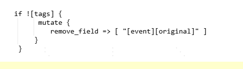

# logstash内置字段介绍以及elk磁盘使用优化

# 1. **核心字段**

* <code>**@timestamp**</code>\ 事件被Logstash处理的时间戳，默认是Logstash接收事件的时间。用户可通过<code>date</code>插件覆盖此字段，例如从日志中提取时间作为实际时间[5](https://www.lmlphp.com/user/79978/article/item/2633084/)[7](https://blog.51cto.com/u_16099329/7217615)。
* <code>**@version**</code>\ 事件的版本号，标识Logstash处理事件的格式版本，通常为固定值<code>1</code>。
* <code>**host**</code>\ 运行Logstash的主机信息，包含主机名、IP地址等。用户可通过<code>mutate</code>插件修改或补充此字段（如从日志路径提取IP）[1](https://blog.csdn.net/xpsallwell/article/details/77198215)[5](https://www.lmlphp.com/user/79978/article/item/2633084/)。
* <code>**message**</code>\ 原始日志的完整内容。在过滤阶段可能被截断或修改，例如通过<code>truncate</code>插件限制长度[1](https://blog.csdn.net/xpsallwell/article/details/77198215)

***

# 2. **元数据字段**

* <code>**@metadata**</code>\ 用于存储临时数据的特殊字段，内容不会输出到最终事件中，常用于条件判断或中间处理。例如，<code>[@metadata][type]</code>可辅助动态路由[2](https://blog.csdn.net/smithallenyu/article/details/52181249)[7](https://blog.51cto.com/u_16099329/7217615)。
* <code>**tags**</code>\ 标记事件的数组字段，用于分类或标识处理状态（如解析失败时添加<code>_grokparsefailure</code>标签）。用户可通过条件语句动态添加或删除标签[1](https://blog.csdn.net/xpsallwell/article/details/77198215)[2](https://blog.csdn.net/smithallenyu/article/details/52181249)。
* <code>**type**</code>\ 事件的类型标识（旧版本中常见），通常由用户自定义。例如在配置中通过<code>[@metadata][type]</code>设置类型为<code>log</code>[1](https://blog.csdn.net/xpsallwell/article/details/77198215)。

###  

# 3.pipeline**扩展字段（动态生成）**

* <code>**[log][file][path]**</code>\ 日志文件路径，用户可通过<code>grok</code>插件解析路径并提取子字段（如应用名、环境等）
* <code>**[event][original]**</code>\ 原始事件的副本，用户可选择在最终输出中移除此字段以节省存储
* 举例：

> 更新: 2025-05-09 14:28:19  
> 原文: <https://www.yuque.com/zilin-hw8cn/po91to/irb4dtuogfo31ys5>