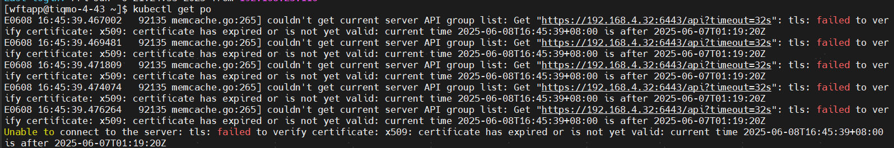
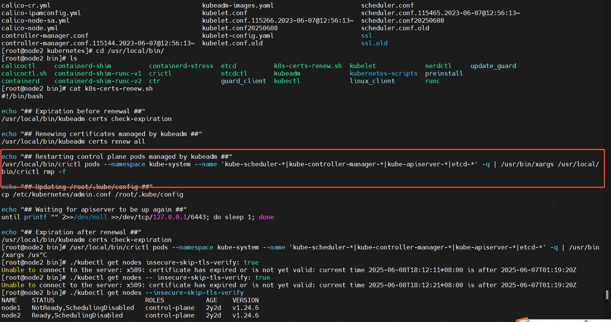
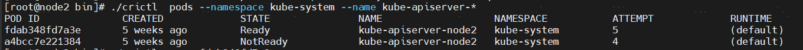
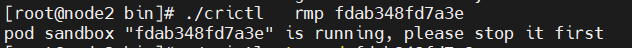
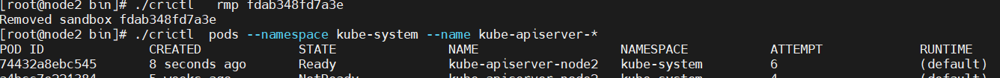

# kubeadm更新k8s 集群证书

### 报错现象“Unable to connect to the server: x509: certificate has expired or is not yet valid: current time 2024-06-06T14:18:41+08:00 is after 2024-06-06T04:55:12Z
“0606 15:31:01.344534   62640 memcache.go:265] couldn't get current server API group list: the server has asked for the client to provide credentials


### 原因：k8s 集群x509证书过期
## 查看证书是否过期
```shell
kubeadm certs check-expiration                      
```


##   批量更新证书
 

```shell
kubeadm certs renew all           
```

### **<font style="color:rgb(0, 0, 0);">在所有的master节点都执行 kubeadm certs renew all   </font>**
## **<font style="color:rgb(0, 0, 0);">更新kubeconfig 相关文件</font>**
### 备份原来的kubeconfig文件
cd /etc/kubernetes

 mv admin.conf admin.conf20240606

mv kubelet.conf kubelet.conf20240606

mv controller-manager.conf controller-manager.conf20240606

mv scheduler.conf scheduler.conf20240606

### 生成新的kubeconfig
kubeadm init phase kubeconfig all


### 重启kubelet
<font style="color:rgb(68, 68, 68);">systemctl restart kubelet</font>


### <font style="color:rgb(68, 68, 68);">更新kubectl配置 cp /etc/kubernetes/admin.conf ~/.kube/config</font>
### 如果有多个master节点，将ssl证书以及 kube config 拷贝过去，替换掉


##

# **<font style="color:#DF2A3F;">踩坑记</font>**
提前1天更新证书之后，到期了还是提示




于是按照kubespray官方的脚本命令重启master node1所有pod，**<font style="color:#DF2A3F;">结果pods全部起不来，node1节点挂了</font>**




**<font style="color:rgb(0, 0, 0);">只能换成master node2，master node2 更新证书之后</font>**

**<font style="color:rgb(0, 0, 0);">还是报证书过期。解决方案要重启apiserver</font>**

**<font style="color:#DF2A3F;">只重启apiserver。命令如下</font>**

**<font style="color:#DF2A3F;">1.找到apiserer对应的pod id </font>**

**<font style="color:#DF2A3F;">./crictl  pods --namespace kube-system --name kube-apiserver-*</font>**

**<font style="color:#DF2A3F;">  
</font>****<font style="color:#DF2A3F;">2.重启apiserver pod前必须停止sandbox</font>**

**<font style="color:#DF2A3F;">./crictl stopp fdab348fd7a3e</font>**




**<font style="color:#DF2A3F;">3.重启api server pod</font>**

**<font style="color:#DF2A3F;">./crictl   rmp fdab348fd7a3e</font>**




> 更新: 2025-06-08 18:53:11  
> 原文: <https://www.yuque.com/zilin-hw8cn/po91to/lgueknd5n0h4erpq>