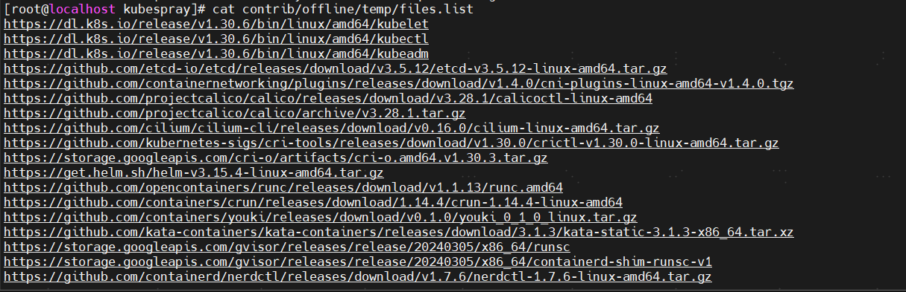

# kubespay安装k8s集群1.30.6

kubespay安装k8s集群1.30

kubespray 不同版本对应不同版本的ansible

# 安装python3.10
[https://blog.csdn.net/Bsummer/article/details/140001234](https://blog.csdn.net/Bsummer/article/details/140001234)

# 切换分支到release-2.26对应k8s版本为1.30.6
git clone [https://gitlab.swifer.co/fbu-public/kubespray.git](https://gitlab.swifer.co/fbu-public/kubespray.git)

cd kubespray/

切换到 release-2.26

git checkout release-2.26

# 安装ansible等必要依赖
pip3 install -r  requirements.txt 或者

 pip3  install -r requirements.txt -i [http://mirrors.aliyun.com/pypi/simple/](http://mirrors.aliyun.com/pypi/simple/) --trusted-host mirrors.aliyun.com

## 验证ansible是否安装成功
/usr/local/python3.10/bin/ansible --version(下载的ansible包<font style="color:#DF2A3F;">是在pyton目录下面的</font>) 这里卡了我好久

## 创建ansible和ansible-playbook的软链接
ln -s /usr/local/python3.10/bin/ansible /usr/bin/ansible

 ln -s /usr/local/python3.10/bin/ansible-playbook /usr/bin/ansible-playbook


# 执行脚本下载镜像清单（此处需要翻墙）
[root@localhost kubespray]# bash contrib/offline/generate_list.sh

验证清单



下载包

wget -x -P /home/wftapp/kubespray/contrib/offline/temp/files -i /home/wftapp/kubespray/contrib/offline/temp/files.list


（此处有一个大坑，有些软件下载下来的版本跟列表的不一致，release-2.26 cluster脚本错误指定了1.30.4版本，需要改正成1.30.6, kubeadm kubelet等都是下载的1.30.6版本，etcd实际需求版本比下载的新，需要重新下载最新版本上传到swiftpass仓库）

# 新增初始化脚本 sp/setup-extral.yml（官网是没有的）
- hosts: all

  gather_facts: false

  tasks:

    - name: "Set up log path"

      file:

        path: "/data/logs/k8s"

        owner: root

        group: root

        mode: '777'

        state: directory


    - name: "setup soft"

      yum:

        name: "{{item}}"

        state: present

      with_items:

        - nfs-utils

        - chrony


    - name: "enable service"

      systemd:

        name: "{{item}}"

        state: started

        enabled: yes

      with_items:

        - chronyd


    - name: update sshd config

      become: yes

      become_user: root

      lineinfile:

        dest: "/etc/ssh/sshd_config"

        regexp: '#?\s?UseDNS\s+'

        line: "UseDNS no"

        state: present

        backup: yes


    - name: update selinux config

      become: yes

      become_user: root

      lineinfile:

        dest: "/etc/selinux/config"

        regexp: '#?\s?SELINUX\s+'

        line: "SELINUX=disable"

        state: present

        backup: yes

    - name: diable by cmd imediately

      command: "setenforce 0"

      ignore_errors: yes  # 避免SELinux已禁用时报错

      changed_when: false # 防止重复执行时误判状态变更


    - name: disalbe service

      systemd:

        name: "{{item}}"

        state: stopped

        enabled: no

      with_items:

        - firewalld


# 修改k8s集群配置文件
inventory/tiqmo-dev/group_vars/k8s_cluster/k8s-cluster.yml

域名需要跟tiqmo-dev环境保持一致，需要修改为：

cluster_name: tiqmo-dev.cluster.local


# 创建集群
ansible-playbook -i inventory/tiqmo-dev/inventory.ini -i sp/setup-extral.yml cluster.yml -b

# 尝试把1.23版本的ETCD恢复到1.30.6,操作失败（行不通）


# k8s 集群重置命令
ansible-playbook -i inventory/tiqmo-dev/inventory.ini cluster.yml  reset.yml -b

<font style="color:#DF2A3F;">重置命令会删除整个集群，请谨慎操作！</font>

<font style="color:#DF2A3F;"></font>

# k8s扩容节点
<font style="color:#DF2A3F;">ansible-playbook -i inventory/tiqmo-dev/inventory.ini sp/setup-extral.yml  -b -l node7</font>

<font style="color:#DF2A3F;"></font>


 ansible-playbook -i inventory/tiqmo-dev/inventory.ini scale.yml -b --limit node7


# etcd备份数据命令
ETCDCTL_API=3 ./etcdctl   --endpoints=[https://192.168.4.105:2379](https://192.168.4.105:2379)   --cacert=/etc/ssl/etcd/ssl/ca.pem    --cert=/etc/ssl/etcd/ssl/admin-node1.pem    --key=/etc/ssl/etcd/ssl/admin-node1-key.pem    snapshot save /data/snapshot.db


# etcd备份恢复


每个节点的etcd都要先停服，并且移除/var/lib/etcd目录

每个节点依次恢复

```plain
ETCDCTL_API=3 /usr/local/bin/etcdctl snapshot restore /data/snapshot.db  \

--name etcd1 \ 
--data-dir=/var/lib/etcd \ 
--initial-cluster "etcd1=https://192.168.4.105:2380,etcd2=https://192.168.4.106:2380,etcd3=https://192.168.4.107:2380" \ 
--initial-cluster-token=k8s_etcd \ 
--initial-advertise-peer-urls https://192.168.4.105:2380  # 当前节点IP 

```


```plain
ETCDCTL_API=3 /usr/local/bin/etcdctl snapshot restore /data/snapshot.db  \

--name etcd2 \ 
--data-dir=/var/lib/etcd \ 
--initial-cluster "etcd1=https://192.168.4.105:2380,etcd2=https://192.168.4.106:2380,etcd3=https://192.168.4.107:2380" \ 
--initial-cluster-token=k8s_etcd \ 
--initial-advertise-peer-urls https://192.168.4.106:2380  
```


```plain

ETCDCTL_API=3 /usr/local/bin/etcdctl snapshot restore /data/snapshot.db  \

--name etcd3 \ 
--data-dir=/var/lib/etcd \ 
--initial-cluster "etcd1=https://192.168.4.105:2380,etcd2=https://192.168.4.106:2380,etcd3=https://192.168.4.107:2380" \ 
--initial-cluster-token=k8s_etcd \ 
--initial-advertise-peer-urls https://192.168.4.107:2380 
```


# etcd恢复后关键操作
**<font style="color:rgba(0, 0, 0, 0.9);">apiserver是静态Pod模式</font>**<font style="color:rgba(0, 0, 0, 0.9);">（需手动触发重建）</font>

## <font style="color:rgba(0, 0, 0, 0.9);">apiserver重启操作</font>
<font style="color:rgb(0, 0, 0);"># 1. 定位Pod定义文件 find /etc/kubernetes/manifests/ -name 'kube-apiserver.yaml' </font>

<font style="color:rgb(0, 0, 0);"># 2. 触发重建（移动文件后自动恢复） sudo mv /etc/kubernetes/manifests/kube-apiserver.yaml /tmp/ && sleep 20 && sudo mv /tmp/kube-apiserver.yaml /etc/kubernetes/manifests/ </font>

<font style="color:rgb(0, 0, 0);"># 3. 观察重建过程 kubectl get pods -n kube-system -l component=kube-apiserver -w </font>


> 更新: 2025-06-12 17:15:32  
> 原文: <https://www.yuque.com/zilin-hw8cn/po91to/tir5ybaprb9i1egt>