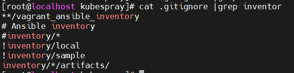
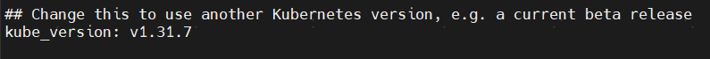
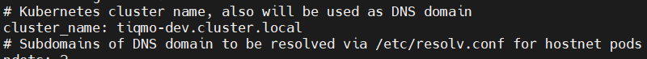
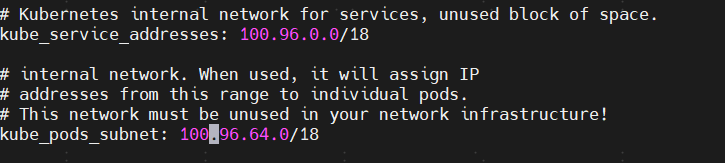
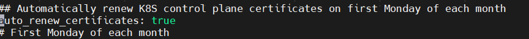
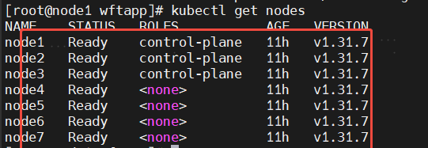

# kubespray k8s 1.30.6升级到k8s 1.31.7

# 从github拉取源码

git clone <https://github.com/kubernetes-sigs/kubespray.git>

# 切换分支到release-2.27

git checkout release-2.27

# 执行脚本下载镜像清单

\[root@localhost kubespray]# bash contrib/offline/generate\_list.sh

# 下载必要的软件

wget -x -P /home/wftapp/kubespray/contrib/offline/temp/files -i /home/wftapp/kubespray/contrib/offline/temp/files.list

(files的路径必须在offline/temp下，不然软件上传到swifter.io的路径会不一致，导致安装的时候报找不到包)

# **上传软件到swiftpass jforg仓库**

cd /root/kubespray/contrib/offline/temp/files/

for i in `find . -type f `; do curl -H "X-JFrog-Art-Api:${JFROG_API_KEY}" -T ${i:2} "<https://repo.swifer.co/artifactory/download/${i:2}";> done

# 修改git仓库地址为gitlab

git remote -v

git remote remove origin

git remote add origin <https://192.168.1.69:8000/devops/tiqmo/kubespray.git>

手动创建一个gitlab的release-2.27分支

# 将release-2.27的源码推送到release-2.27 gitlab分支

git branch -M release-2.27

git push -uf origin release-2.27

# 更新必要的配置

从master（release-2.26）分支拷贝 inventory 的tiqmo-dev机器配置清单

去掉ignore配置，不然tiqmo-dev上传不上去

## k8s-cluster.yaml相关配置

ls inventory/tiqmo-dev/group\_vars/k8s\_cluster/k8s-cluster.yml

:::info
确认版本号是否正确

修改domain name为 tiqmo-dev.cluster.local

:::

修改默认ip 地址段为100.96

修改证书自动更新为true

## 修改offline.yaml仓库相关下载地址，镜像地址

ls inventory/tiqmo-dev/group\_vars/all/offline.yml

将额外的初始化操作sp/setup-extral.yml也从release-2.26考过来

# **升级前先备份etcd，备份恢复操作参考之前的1.30.6部署文档。**

确保当前集群状态是正常的

升级顺序，先升级master节点，再升级node节点

升级之前先把污点移除，master节点默认是没有污点的

# 升级master节点

ansible-playbook -i inventory/tiqmo-dev/inventory.ini -i sp/setup-extral.yml upgrade-cluster.yml -b -l node1

ansible-playbook -i inventory/tiqmo-dev/inventory.ini -i sp/setup-extral.yml upgrade-cluster.yml -b -l node2

ansible-playbook -i inventory/tiqmo-dev/inventory.ini -i sp/setup-extral.yml upgrade-cluster.yml -b -l node3

# 升级node节点

ansible-playbook -i inventory/tiqmo-dev/inventory.ini -i sp/setup-extral.yml upgrade-cluster.yml -b -l node4,node5,node6,node7

# kubectl命令格式

kubectl命令行格式跟旧版本不太一样

# 1.31kubectl正确语法例子

:::info
kubectl -n account exec -it  aia-tcs-service-c746d8775-k57sz  -- /bin/sh

:::

> 更新: 2025-06-12 17:18:34  
> 原文: <https://www.yuque.com/zilin-hw8cn/po91to/newsv3pf2hk6iu75>
