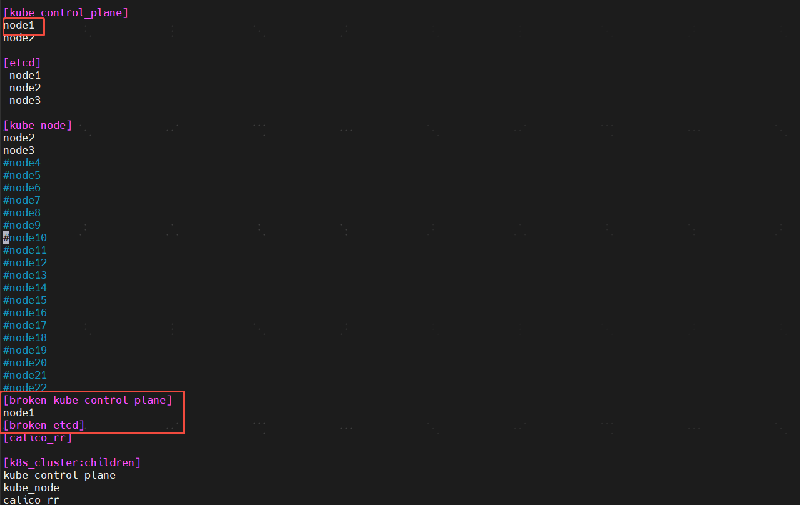
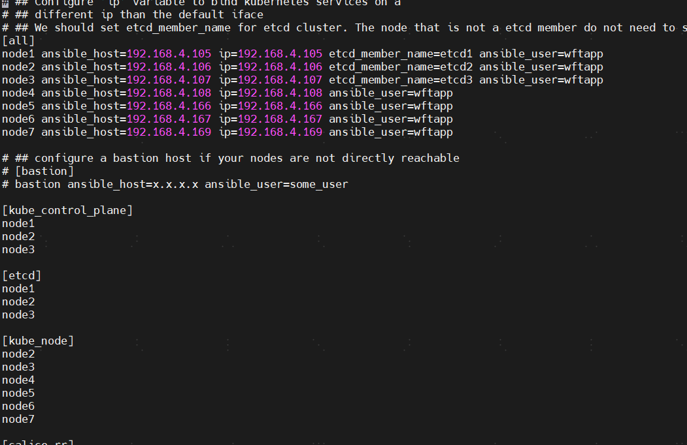
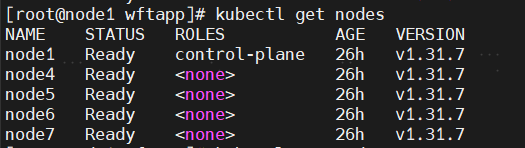
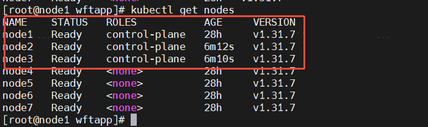
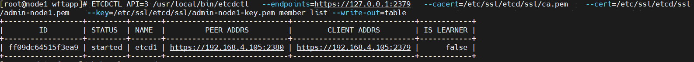
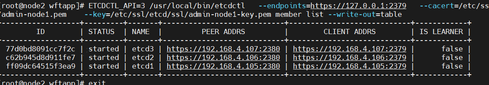

# kubespray恢复备份以及新增删除节点操作

# 利用recovery脚本恢复管理集群
假设其中的管理集群节点node1挂了

先修改inventory.ini

## 把移除的节点加到对应的模块

**ansible-playbook -i sp/inventory/tiqmo-dev/inventory.ini  recover-control-plane.yml   -b --limit etcd,kube_control_plane -e old_etcd_members=node1 -e old_etcds=node1 -e old_kube_masters=node1**

**!!! 执行恢复命令会自动摘除node1**

# **尝试恢复etcd数据，没有生效**
ansible-playbook -i inventory/tiqmo-dev/inventory.ini recover-control-plane.yml -b -l etcd,control_plane -e etcd_retries=10 -e "etcd_snapshot=/tmp/snapshot.db"

恢复集群操作

# 加删contralplane节点
**在执行recover脚本移除异常节点之后，一直新增管理节点不成功，原因是用recover脚本移除管理节点后还残留旧数据。正确操作：先执行remove.yml脚本，把问题节点全部移除，然后在重新执行添加管理节点操作**

## 把节点注释去掉 以及把broker相关的模块去掉
重新执行命令

ansible-playbook -i inventory/tiqmo-dev/inventory.ini -i sp/setup-extral.yml cluster.yml -b -l node1,node2,node3 

没有达到预想的效果,node2和node3 并没有成功加回来

## kubespray不允许删除node1节点，如果要删除只能调换顺序

## 执行更新contralplane（新增）节点命令未生效
ansible-playbook -i inventory/tiqmo-dev/inventory.ini -i sp/setup-extral.yml cluster.yml --limit=kube_control_plane

## 尝试删除有问题的控制节点后再新增（成功）
删除节点命令

ansible-playbook -i inventory/tiqmo-dev/inventory.ini  remove-node.yml -e node=node2 -b

ansible-playbook -i inventory/tiqmo-dev/inventory.ini  remove-node.yml -e node=node3 -b

重新添加管理节点

一定要用cluster.yml清单执行管理节点扩容操作

 ansible-playbook -i inventory/tiqmo-dev/inventory.ini -i sp/setup-extral.yml cluster.yml -b

终于成功新增管理节点以及etcd节点

成功前etcd节点数量

成功后 etcd节点数量

# 删除工作节点命令
ansible-playbook -i sp/inventory/tiqmo-dev/inventory.ini remove-node.yml -b --limit=node11

# 关于新增删除操作的官方文档
官方文档介绍

[https://kubespray.io/#/docs/operations/nodes?id=limitation-removal-of-first-kube_control_plane-and-etcd-master](https://kubespray.io/#/docs/operations/nodes?id=limitation-removal-of-first-kube_control_plane-and-etcd-master)

> 更新: 2025-06-11 12:37:59  
> 原文: <https://www.yuque.com/zilin-hw8cn/po91to/eumarrx2n9mq97pg>