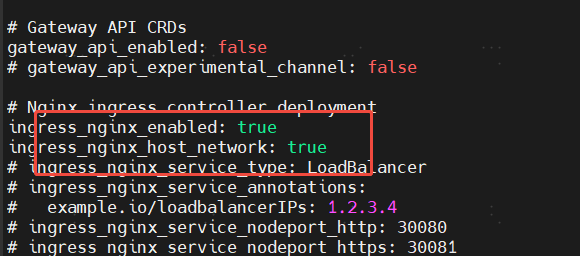

# kubespray新增addon组件，比如ingress-nginx

cat inventory/tiqmo-dev/group_vars/k8s_cluster/addons.yml

 ansible-playbook -i inventory/tiqmo-dev/inventory.ini -i sp/setup-extral.yml cluster.yml -b

> 更新: 2025-04-24 17:31:58  
> 原文: <https://www.yuque.com/zilin-hw8cn/po91to/gx38wue96mk4769p>